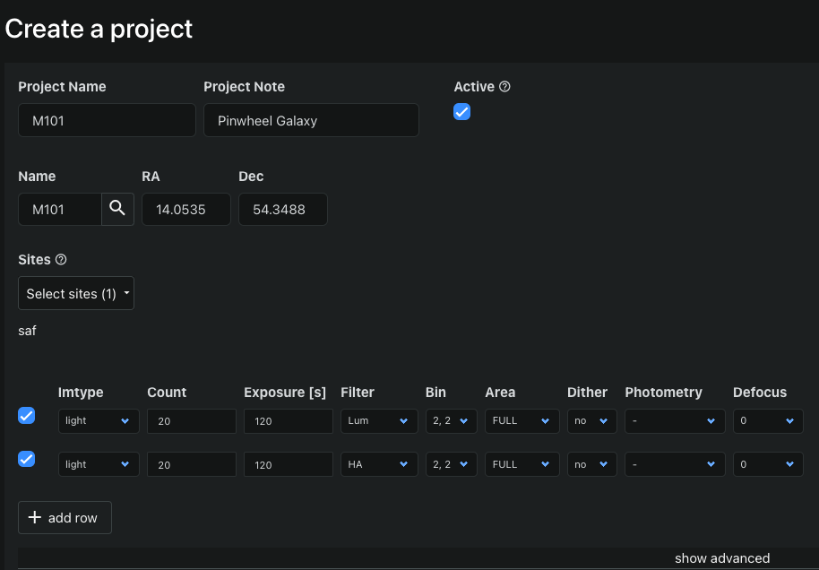

# Photon Ranch Projects

This repository manages the backend service for projects at www.photonranch.org. Communication between requests through the web interface and the projects database operations at AWS occur here.

This is a Serverless API deployed by the Serverless Framework, which creates and runs the Python functions in `handler.py` in AWS Lambda.

## Description

Photon Ranch supports two main types of observing sessions: real-time and scheduled. Scheduled observing sessions run on projects, which users can create on the web interface at photonranch.org/site/{sitecode}/projects. A project is a JSON object containing the details required to be performed automatically by an observatory. To schedule, projects are added to a [calendar reservation](https://github.com/LCOGT/photonranch-calendar).



Requests related to the projects backend include:

- Creating a new project
- Modifying the details of an existing project
- Deleting a project
- Retrieving a specific project, a list of projects created by a specific user, or a list of all existing projects
- Adding a calendar event to a project
- Updating a project with exposures taken (currently used by observatories)

Projects are designed to store not only the request details, but also pointers to completed images and completion status. In order for this model to work, the site that completes an image for a project request should send the appropriate metadata using the projects APIs. 

## Dependencies

This application currently runs under Python 3.9. Serverless requirements for deployment are listed in `package.json`. A list of Python dependencies, which the `serverless-python-requirements plugin` zips for the Lambda environment, can be found in `requirements.txt`.

To update npm dependencies, run `npm update`. This will update the package versions in `package-lock.json`.

## Local Development

Clone the repository to your local machine:

```
git clone https://github.com/LCOGT/photonranch-projects.git
cd photonranch-projects
```

### Requirements

You will need the [Serverless Framework](https://www.serverless.com/framework/docs/getting-started) installed locally for development. For manual deployment to AWS as well as for updating dependencies, you will need to install [Node](https://nodejs.org/en/), [npm](https://docs.npmjs.com/downloading-and-installing-node-js-and-npm), and [AWS CLI](https://docs.aws.amazon.com/cli/latest/userguide/getting-started-install.html), configuring with your own AWS credentials.

### Deployment

Changes pushed to the test, dev, and main branches are automatically deployed to the corresponding test, dev, and production stages with Github Actions. For manual deployment on your local machine, you'll first need to fill out the `public_key` and `secrets.json` with the required information, and install packages:

```
npm install
serverless plugin install --name serverless-python-requirements
```

To deploy, run:

```
serverless deploy --stage {stage}
```

In the case that a Serverless or AWS key has been reset, you will need to update these manually in this repository's settings for Github Actions to continue deploying. You must be a repository collaborator to edit these.

### Testing

Instructions to manually run tests will be detailed here.

## Projects Request Syntax

The body of a project is a JSON object composed with the following syntax.

```javascript
{
  // Example project
  "user_id": "google-oauth2|xxxxxxxxxxxxxxxxxxxxx",  // Auth0 user 'sub'
  "project_constraints": {  // Constraining parameters for automatic scheduling
    "dec_offset_units": "deg",
    "meridian_flip": "flip_ok",
    "add_center_to_mosaic": false,
    "close_on_block_completion": false,
    "project_is_active": false,
    "prefer_bessell": false,
    "dark_sky_setting": false,
    "frequent_autofocus": false,
    "ra_offset": 0,
    "lunar_phase_max": 60,
    "min_zenith_dist": 0,
    "lunar_dist_min": 30,
    "enhance_photometry": false,
    "max_airmass": 2,
    "dec_offset": 0,
    "generic_instrument": "Main Camera",
    "max_ha": 4,
    "ra_offset_units": "deg",
    "near_tycho_star": false,
    "position_angle": 0
  },
  "project_name": "Trifid SRO Filters",
  "scheduled_with_events": [],  // Associated calendar reservations
  "created_at": "2022-04-26T00:56:09Z",
  "remaining": [  // Number of exposures left to take, for each set of exposures
    "3",
    "30"
  ],
  "project_note": "SRO filters",
  "project_data": [  // Filenames of completed exposures
    [],
    []
  ],
  "project_sites": [  // Which site to observe or auto-schedule at (planned)
    "sro"
  ],
  "exposures": [  // Details of each exposure request
    {
      "area": "FULL",
      "filter": "PL",
      "dither": "no",
      "exposure": "15",
      "bin": "1, 1",
      "count": "3",
      "photometry": "-",
      "imtype": "light",
      "defocus": 0
    },

    {
      "area": "FULL",
      "filter": "HA",
      "dither": "no",
      "exposure": "120",
      "bin": "1, 1",
      "count": "30",
      "photometry": "-",
      "imtype": "light",
      "defocus": 0
    },
  ],
  "project_targets": [  // Target name, right ascension, and declinations
    {
      "name": "M 20",
      "dec": "-22.9717",
      "ra": "18.0450"
    }
  ]
}
```

### Request Parameters

**project_name** and **created_at**: Projects are uniquely identified by the combination of their name and creation date.

**exposure_index**: The exposure_index value specifies which of the multiple requested exposures was used for the completed file. 

**base_filename**: This is the general filename that is used to get the images completed in a project. Base filenames currently follow a "sitecode-camera_name-date-exp_number" format, such as "saf-sq002me-20220615-00022012", with a reminder that this should not include the EX00 value or the .fits file extensions.

**target_index (currently not supported)**: When projects used to support multiple targets, the target index behaved like the exposure index, and the project_data had one more level of nesting. Files would save at `project_data[target_index][exposure_index]`. We have opted to remove this feature; however, multi-target project support may be added again in the future.

## API Endpoints
Project requests are handled at the base URL `https://projects.photonranch.org/{stage}`, where `{stage}` is the deployment stage in ["test", "dev", "prod"]. Currently, both the production and development stages point to the dev URL, though this will change in the future.

- POST `/new-project`
  - Description: Adds a new project to the projects database.
  - Authorization required: No.
  - Request body:
    - `project_name` (string): Name of the project to create.
    - `created_at` (string): UTC datestring at time of project creation.
    - `user_id` (string): Auth0 user 'sub' of the user creating the project.
    - `new_project` (dict): Full details of the project being created.
  - Responses:
    - 200: Successfully added new project.
    - 400: Missing required key in `[project_name, user_id, created_at]`.

- POST `/modify-project`
  - Description: Modifies the details of an existing project. Users can only modify their own projects, unless they are an admin.
  - Authorization required: Yes.
  - Request body:
    - `project_name` (string): Name of the project to modify.
    - `created_at` (string): UTC datestring at time of project creation.
    - `project_changes` (dict): Project changes to apply.
  - Responses:
    - 200: Successfully modified project details.
    - 400: Bad request.

- POST `/get-project`
  - Description: Retrieves the details of a specified project.
  - Authorization required: No.
  - Request body:
    - `project_name` (string): Name of the project.
    - `created_at` (string): UTC datestring at time of project creation.
  - Responses:
    - 200: Successfully returned project details.
    - 404: Project not found.

- POST `/get-all-projects`
  - Description: Retrieves a list of all existing projects from the DynamoDB table.
  - Authorization required:  No.
  - Request body: None.
  - Responses:
    - 200: Return a JSON of all projects.

- POST `/get-user-projects`
  - Description: Retrieves a list of all projects created by a specified user.
  - Authorization required: No.
  - Request body:
    - `user_id` (string): Auth0 user 'sub' of the user's projects we want to retrieve.
  - Responses:
    - 200: Return a JSON of project details.
    - 400: Missing required key `user_id`.

- POST `/add-project-data`
  - Description: Updates a project with the filenames of newly taken exposures. This endpoint is used by observatories to track the completion progress of a project.
  - Authorization required: No.
  - Request body:
    - `project_name` (string): Name of the project to update exposures progress.
    - `created_at` (string): UTC datestring at time of project creation.
    - `exposure_index` (int): Index of the most recently taken exposure.
    - `base_filename` (string): Name of the image taken to add to the project details.
  - Responses:
    - 200: Successfully updated project.
    - 500: Failed to update project in DynamoDB.

- POST `/add-project-event`
  - Description: Adds a calendar event to the details of a project.
  - Authorization required: No.
  - Request body:
    - `project_name` (string): Name of the project to add calendar events to.
    - `created_at` (string): UTC datestring at time of project creation.
    - `event_id` (string): Id of the calendar event to add.
  - Responses:
    - 200: Successfully associated event with project.
    - 200: Event already associated with project.

- POST `/delete-project`
  - Description: Deletes a project from the DynamoDB table.
  - Authorization required: Yes.
  - Request body:
    - `project_name` (string): Name of the project to delete.
    - `created_at` (string): UTC datestring at time of project creation.
    - `requester_id` (string): Auth0 user 'sub' of user requesting deletion.
    - `user_id` (string): Auth0 user 'sub' of user who created project.
  - Responses:
    - 200: Successfully deleted project.
    - 403: Unauthorized request.

### Example Requests

The following example demonstrates how to use the `/add-project-data` endpoint, the endpoint observatories use to update a project with the exposure completion status.

```python
import requests, json
    
url = "https://projects.photonranch.org/dev/add-project-data"
request_body = json.dumps({

  # A project is uniquely specified by the pair of values: project_name and created_at. 
  "project_name": "M31 Example Project",
  "created_at": "2022-07-01T23:45:37Z",

  # Specify which exposure request is being added to the project data.
  "exposure_index": 0,
  "base_filename": "dht-sq11-20220701-00001"
  })

response = requests.post(url, request_body)
print(response.json()) 
```

This example demonstrates how to use the `/get-project` endpoint to obtain the details of a project.

```python
import requests, json

url = "https://projects.photonranch.org/dev/get-project"
request_body = json.dumps({
  "project_name": "M31 Example Project",
  "created_at": "dht-sq11-20220701-00001",
})

response = requests.post(url, request_body).json()
print(json.dumps(response, indent=2))
```

For more examples using these endpoints with Python, see `examples.py`.

## License
